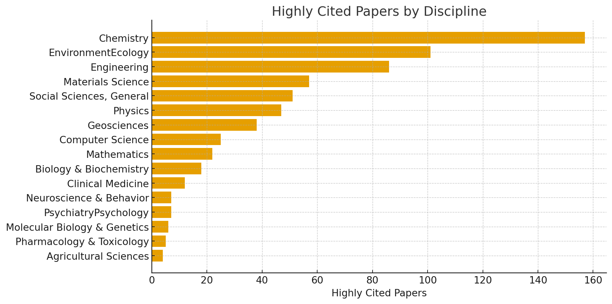

## ECNU 学科数据分析报告

- 数据来源文件：analysis.xlsx
- 覆盖学科数：16
- 平均排名：614.7；中位数排名：392.0
- 最佳学科排名：90（Chemistry）
- 相对薄弱排名：2852（Clinical Medicine）

### 一、数据概览

以下是我对 analysis.xlsx 的截图：

### 二、关键发现

利用Excel的排名功能，我总结了各项的前五名：

**总被引量 Top 学科：**
Discipline  		Citations
Chemistry           	164390
Materials Science        93969
EnvironmentEcology  92088
Engineering                  55450
Physics                          50802

**论文产出 Top 学科：**
Discipline                      Papers
Chemistry    		  5420
Physics                            3495
EnvironmentEcology    2941
Materials Science         2720
Engineering                   2567

**单篇影响力（CitesPerPaper）Top 学科：**
Discipline  				      CitesPerPaper
Molecular Biology & Genetics          38.66
Materials Science                                34.55
EnvironmentEcology                          31.31
Chemistry                                             30.33
Biology & Biochemistry                      23.23

**相关性（越接近 -1 越表明“指标高、排名好（数值小）”的负相关越强）：**
- 排名 vs 论文数：-0.512
- 排名 vs 总被引：-0.413
- 排名 vs 单篇被引：-0.048

### 三、图表

1. 学科排名条形图（ECNU Rank by Discipline）

- 横轴：各学科；纵轴：全球排名（数值越小越好）。
- 作用：一眼看出哪些学科排名更靠前/更靠后。

2. 论文数-总被引散点图（Papers vs Citations）

- 横轴：论文数量；纵轴：总被引次数。
- 作用：看“产出规模”与“学术总影响力”的关系，点越靠右上，规模与影响力越强。

3. 单篇影响力条形图（Cites per Paper by Discipline）

- 横轴：各学科；纵轴：单篇平均被引（Cites per Paper）。
- 作用：比较论文“质量/影响力均值”，值越高说明单篇影响更强。

4. 高被引论文数条形图（Highly Cited Papers by Discipline）

- 横轴：各学科；纵轴：高被引论文数量。

- 作用：衡量能产出“头部成果”的能力，数量越大说明高影响力论文储备更足。

### 四、发展建议

1. 先把强项做得更强
   重点支持化学、环境与生态、材料科学这几个已经表现很好的学科。做法很简单：多组织高质量的综述或方法类论文，多和海外强校联合发文，让论文数量多、被引高的优势继续扩大。

2. 明确短板，定点提升
   临床医学等相对靠后的学科，先选2–3个最可能出成果的小方向（比如数据分析、医学成像、公共健康等），配上负责人和小团队，给到共享设备和数据支持，做能落地、能发好文章的项目。

3. 数量与影响力一起抓
   数据显示：总被引和排名的关系更紧。具体做法：
   - 在保证质量的前提下，适度增加系列论文的产出；
   - 鼓励开放数据、开源代码，方便他人复用和引用；
   - 重要结果尽量以团队署名、稳定发在影响力较高的刊物上。

4. 用强带弱，做交叉
   让化学或材料科学去带动环境与生态、工程学；让计算机科学去赋能地球科学、临床医学的数据分析。可以建小型交叉研究坊，把数据、算力和脚本集中管理，方便不同学院一起做题目。

5. 做高被引论文小目标
   设一个三年高被引计划：每年挑一些热门话题，组织综述或方法类论文；对进展好的团队，提供版面费、数据清洗、语言润色等支持，盯着高被引指标去努力。

6. 面向学生的具体机会

     a.  本科生或研究生可参加数据标注、复现实验、开源工具等工作，论文里列为共作者或致谢；

     b.  每学期举办小型写作与图表工作坊（如何做清晰图、怎样写方法与讨论），直接用本校数据做例子；

     c.  开设交叉选修（如“环境数据可视化”“材料表征与机器学习”），让不同专业的同学快速上手合作。

7. 多做国际合作，提升单篇质量
   和全球前50的强势团队建立一两条稳定的合作线：共享样品或数据、互访交流、共同指导学生。这样能直接抬升单篇质量，也更容易被顶刊读者看到。

8. 改善科研生态
   评价不只看论文数量，也看数据集、软件、专利或标准等成果；学院层面定期做成果展示（海报、代码、数据），让外界更容易发现并引用我们的工作。
